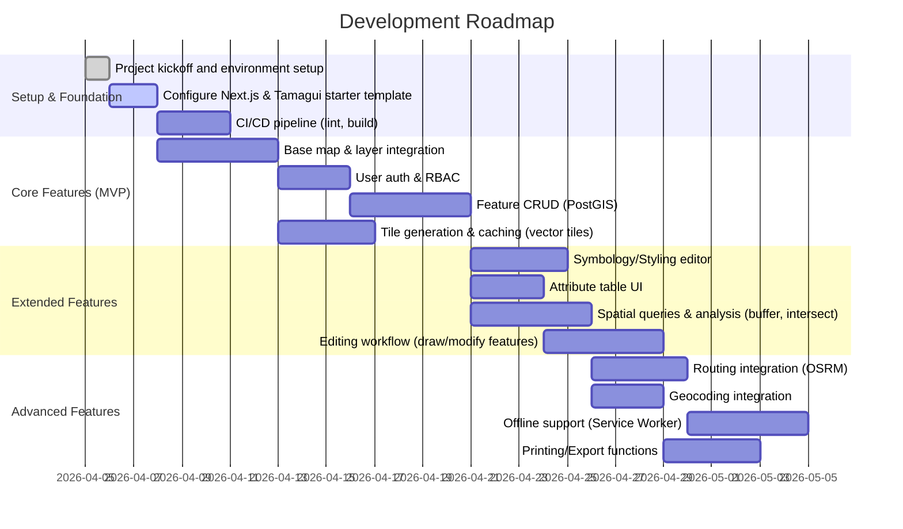

# Executive Summary  
We propose a modern, high-performance Web GIS stack built with TypeScript, Next.js, and Tamagui on the front end, and a robust geospatial backend (e.g. PostgreSQL/PostGIS, vector-tile servers, and spatial engines) on the back end. The design mirrors core ArcGIS capabilities – dynamic map rendering (2D/3D), vector and raster layers, styling/symbology, labeling, editing, attribute tables, spatial queries/analysis, geoprocessing, routing, geocoding, and robust layer/auth management – while also emphasizing nonfunctional goals (performance, scalability, security, offline support). 

Key decisions include using **MapLibre GL JS** or **OpenLayers** for the map engine due to their GPU-accelerated vector rendering and rich GIS features【26†L15-L22】【27†L22-L24】, a PostgreSQL/PostGIS database for spatial data storage and analysis【36†L13-L17】, and a tile-generation pipeline (e.g. **Tegola** or **Martin** with vector tiles from PostGIS) served via a CDN for fast map loading.  The system will expose **REST/GraphQL APIs** with OAuth2/JWT-based auth, with optional WebSocket support for real-time edits.  The UI will use **Tamagui** for its cross-platform, highly optimized styling, accessible components (e.g. `<Label>` with built-in ARIA support【25†L105-L114】), and responsive layouts.  Core feature implementations will leverage libraries like **Turf.js** (for client-side geoprocessing【51†L20-L24】), **OSRM** or **GraphHopper** for routing, and Nominatim/Mapbox for geocoding, with server-side processing (PostGIS/GDAL) where needed. 

We provide a detailed component architecture (below), a comparative table of mapping libraries, a data model schema, API specifications, UI/UX plans, step-by-step feature implementation outlines, and an agile roadmap with milestones. Each recommendation is grounded in authoritative sources (docs, standards) where available.

## Architecture Overview  
```mermaid
flowchart LR
  subgraph Client [Browser / Mobile App]
    direction TB
    UI[Next.js + Tamagui UI (React)] 
    MapComp[Map Component (MapLibre/OpenLayers)]
    Controls[UI Controls (Layer picker, Legends, Editor tools)]
    AuthUI[Auth UI (Login/Role management)]
    UI --> MapComp
    UI --> Controls
    UI --> AuthUI
    Offline[Service Worker & IndexedDB (Offline Cache)] 
    UI --> Offline
    Offline --> Sync[Background Sync to Server]
    MapComp -->|API Calls| API
  end

  subgraph Backend [Server / Cloud]
    direction TB
    API[Application Server (Node.js/TypeScript, GraphQL/REST)]
    AuthServer[Auth Service (OAuth2 / JWT)] 
    DB[(PostgreSQL + PostGIS)]
    TileGen[Tile Generation (e.g. **Martin**/Tegola)] 
    TileCache[(Tile Cache / CDN)]
    Geoserver[GIS Server (GeoServer/MapServer)]
    SpatialProc[Spatial Engine (PostGIS functions, GDAL)]
    Cache[(Redis or Memcached)]
    Search[Search Index (e.g. Elasticsearch)]
    Routing[Routing Engine (OSRM/GraphHopper)]
    Geocode[Geocoding API (Nominatim/Mapbox)]
    Logging[Monitoring/Logging (Prometheus, Sentry)]
    CI[CI/CD (GitHub Actions/Jenkins)]
    
    API --> AuthServer
    API --> DB
    API --> Cache
    API --> Geoserver
    API --> Routing
    API --> Geocode
    API --> Logging
    TileGen --> TileCache
    TileCache --> API
    Geoserver --> DB
    SpatialProc --> DB
    SpatialProc --> Geoserver
  end

  subgraph External [External Services]
    OSMM{OSM/Map Data Sources}
    CloudMap[Basemap Tiles (Mapbox, etc.)]
    API -.->|external| OSMM
    API -.->|external| CloudMap
  end

  AuthServer -.-> API
  DB -.-> SpatialProc
  SpatialProc -.-> Geoserver
  TileCache -.-> CloudMap
  DB -->|Import| TileGen
```
**Component responsibilities:** The *Client* (browser or PWA/mobile) uses **Next.js** for routing and SSR/CSR and **Tamagui** for UI components. The core map is rendered by a high-performance WebGL map library (e.g. **MapLibre GL JS** or **OpenLayers**). The *Server* exposes APIs (REST or GraphQL) for map data, features, and analysis. It includes an OAuth2/JWT *Auth Service* for user/role management. Spatial data reside in a **PostgreSQL/PostGIS** database (storing geometry columns per OGC Simple Features【36†L13-L17】), which supports vector queries and analysis (buffer, intersect, etc.). A tile-generation pipeline (e.g. the Rust-based **Martin** or Tegola) reads PostGIS and outputs vector tiles, served via a CDN/Tile Cache for fast map loading. A GIS server like **GeoServer** may sit atop PostGIS to provide standard OGC services (WMS/WFS) if needed. Specialized engines (OSRM for routing, external geocoding services, or even cloud-managed spatial queries) complement the stack. Logging, monitoring, and CI/CD infrastructure ensure reliability and quality.

## Technology Comparison  
We compare leading client-side mapping engines. Each supports vector tiles; performance refers to rendering speed and scalability on modern GPUs.

| Library            | Performance       | Vector Tile Support  | 3D Capability          | License             | React/Next Integration               | WebGL Usage        | Mobile Support           |
|--------------------|-------------------|----------------------|------------------------|---------------------|-------------------------------------|--------------------|--------------------------|
| **MapLibre GL JS** | *Very high:* GPU-accelerated vector rendering【26†L15-L22】.  | Native support (Mapbox style JSON). | Basic (3D extrusions, globe view via raster DEMs). | BSD/MIT (OSS)      | Many wrappers (e.g. [react-map-gl]). Official TS lib. | Yes (WebGL)       | Yes (modern mobile browsers, native SDKs available). |
| **OpenLayers**     | *High:* Uses Canvas2D or WebGL layers【27†L55-L61】; highly optimized. | Supports GeoJSON, GML, Mapbox Vector Tiles, OGC WMTS, etc. | Limited (3D via plugins or WebGL layers; primarily 2D). | BSD License【27†L36-L37】 | No official React binding (use imperative API). | Can use WebGL for performance (2D by default). | Yes (“mobile ready out of the box”【27†L55-L61】).  |
| **Deck.gl**        | *Very high:* GPU/WebGL2 for large data sets【28†L42-L49】. | Usually combined with a basemap (e.g. MapLibre) for tiles. | Strong (layers with altitude, 3D meshes, extruded polygons). | MIT (OpenJS Foundation). | Native React support (React DeckGL)【28†L84-L92】. | Yes (WebGL2/WebGPU).    | Browser only (works on capable mobile browsers). |
| **ArcGIS Maps SDK (JS)** | *High:* WebGL-based with continual optimizations (v4.x). | Built-in for ArcGIS services; supports vector tile layers. | Full 3D globe/scene support. | Proprietary (free tier, requires ArcGIS account). | Integration via Esri React wrapper or esri-loader. | Yes (WebGL).          | Yes (requires plugin, but mobile web supported). |
| **Tangram**        | *High:* WebGL engine tuned for OSM data【29†L309-L312】. | GeoJSON/TopoJSON input; can consume vector tiles. | Native 3D (shaders for buildings, etc.)【29†L309-L317】. | MIT (OSS).            | Integrates as a Leaflet plugin (no official React). | Yes (WebGL).          | Limited (browser only).   |
| **Leaflet**        | *Medium:* Uses HTML/CSS and Canvas; good for small/medium data【33†L94-L102】. | Basic vector (SVG/Canvas), raster tiles; needs plugins for vector tiles. | None (2D only).      | BSD (OSS).            | Official React wrapper (react-leaflet). | No (uses DOM/CSS transforms by default)【33†L81-L90】. | Yes (designed for mobile)【33†L16-L23】. |

*Sources:* MapLibre and OpenLayers official sites【26†L15-L22】【27†L33-L37】, Deck.gl docs【28†L42-L49】, Tangram README【29†L309-L312】, Leaflet docs【33†L16-L24】【33†L94-L102】, and Esri developer documentation【31†L23-L32】. Each library’s capabilities inform our choice – for example, MapLibre GL JS offers robust vector rendering (open-source fork of Mapbox GL, with high GPU performance【26†L15-L22】), while OpenLayers gives extensive GIS functions and broad format support (vector tiles, WMS/WFS, etc.)【27†L33-L37】【58†L30-L34】. Deck.gl excels in visualizing massive datasets, and Esri’s API covers full GIS features but at the cost of a proprietary license.

## Data Model & Storage  
We store spatial and related data in relational tables (PostGIS for geometry), with JSONB for flexible attributes. Below is a simplified schema outline:

| **Table**           | **Columns**                                                                                                           | **Description**                                                   |
|---------------------|-----------------------------------------------------------------------------------------------------------------------|-------------------------------------------------------------------|
| **features**        | `id UUID PK`, `geom GEOMETRY`, `properties JSONB`, `layer TEXT`, `created_at TIMESTAMP`, `updated_at TIMESTAMP`      | Stores vector features. `geom` is a PostGIS geometry column (Point/Line/Polygon)【36†L13-L17】; `properties` holds attribute fields. `layer` indicates the logical layer.  |
| **layers**          | `id UUID PK`, `name TEXT`, `description TEXT`, `style JSON`, `order INT`, `is_visible BOOL`                         | Metadata for each map layer (styling info, default order, etc.). |
| **users**           | `id UUID PK`, `username TEXT`, `email TEXT`, `password_hash TEXT`, `created_at TIMESTAMP`, `last_login TIMESTAMP`   | Authenticated user accounts.                                      |
| **roles**           | `id UUID PK`, `name TEXT`, `description TEXT`                                                                        | Role definitions (e.g. Admin, Editor, Viewer).                    |
| **user_roles**      | `user_id UUID FK`, `role_id UUID FK`                                                                                 | Many-to-many link between users and roles.                        |
| **feature_history** | `hist_id SERIAL`, `feature_id UUID`, `geom GEOMETRY`, `properties JSONB`, `modified_at TIMESTAMP`, `modified_by UUID` | Versioning history: logs each edit to a feature.                  |
| **tiles**           | (MBTiles or file store) **Not a table:** pre-generated vector tiles stored as MBTiles or in object storage/CDN.      | Pre-computed tiles for base/background layers (cached).           |

- *Spatial indexing:* GiST indexes on `features.geom` for fast spatial queries.  
- *Properties storage:* Using JSONB allows dynamic attributes and indexing (GIN indexes) for queries.  
- *Versioning:* Edits to `features` are logged in `feature_history` with timestamps and user. This supports change tracking and “undo” if needed.  
- *Offline Sync:* On the client, an IndexedDB (e.g. via PouchDB or Dexie) will mirror relevant feature data. A service worker caches tiles and API responses. On reconnection, changes sync to the server (via WebSocket or REST sync endpoint) – a common PWA pattern【15†L1-L6】.  
- *Tile Caching:* Vector tiles (e.g. Mapbox Vector Tiles) are pre-generated from PostGIS (using tools like [Martin](https://martin.maplibre.org) or Tippecanoe) and served via a CDN (S3 + CloudFront). On the client, Service Worker caches recent tiles and static assets for offline/fast load.

## API Design  
The backend will expose both REST and GraphQL interfaces for flexibility. Key endpoints include:

- **Authentication:**  
  - `POST /auth/login` – returns JWT access (and refresh) tokens.  
  - `POST /auth/refresh` – exchange refresh token for new access token.  
  - `POST /auth/logout` – revoke tokens.  
  - *(Use OAuth2/OpenID Connect; JWT for token format and RBAC claims)*.

- **Feature Services:**  
  - `GET /api/features?layer={layer}&bbox={minx,miny,maxx,maxy}` – returns GeoJSON features in the bounding box.  
  - `POST /api/features` – create a new feature (body includes layer, geometry, attributes).  
  - `PUT /api/features/{id}` – update a feature’s geometry/attributes.  
  - `DELETE /api/features/{id}` – delete a feature.  
  - `POST /api/features/query` – spatial queries (e.g. within buffer) via JSON body (query parameters).  
- **Attribute Tables:**  
  - `GET /api/attributes?layer={layer}` – list schema/fields for a layer.  
  - `GET /api/attributes/{layer}?filter=...` – filter rows by attribute query.

- **Spatial Analysis:**  
  - `POST /api/analysis/buffer` – body includes `{ geometry, distance }`, returns buffered geometry (can use PostGIS `ST_Buffer`).  
  - `POST /api/analysis/intersect`, `/union`, `/clip`, etc. – calls into PostGIS or Turf.js if client-side.

- **Routing & Geocoding:**  
  - `GET /api/route?start={lat,lon}&end={lat,lon}&mode=car` – calls OSRM/GraphHopper and returns route polyline and directions.  
  - `GET /api/geocode?address={query}` – calls external geocoder (e.g. Nominatim or Mapbox API) and returns coordinates.

- **Export/Printing:**  
  - `GET /api/export?bbox=...&format=pdf` – generates a PDF or image of the map (server-side via headless map export).  
  - `GET /api/print?template={name}&data={...}` – templated report generation.

- **Real-Time Sync (WebSocket):**  
  - Establish a WebSocket connection for sending/receiving feature edits and app state changes. Example: on client edit, send `{"action":"update","layer":"roads","feature":{...}}`; server broadcasts changes to subscribed clients in the same map session.

- **Sample Request/Response:**  
  ```http
  GET /api/features?layer=roads&bbox=-80.0,35.0,-79.0,36.0 HTTP/1.1
  Host: api.example.com
  Authorization: Bearer <JWT_TOKEN>
  ```
  **Response (GeoJSON):**  
  ```json
  {
    "type": "FeatureCollection",
    "features": [
      {
        "type": "Feature",
        "id": "a1b2",
        "geometry": { "type": "LineString", "coordinates": [[-80,35],[ -80,36]] },
        "properties": { "name": "Main St", "speed": 35 }
      },
      /* ... */
    ]
  }
  ```

Authentication will use industry standard flows (OAuth2 “password” or “authorization code” + JWT). Role-based access control is enforced by checking JWT claims for endpoints (e.g. only “Editor” can POST/PUT features). All endpoints should be HTTPS and validate inputs to prevent injection/XSS. No public API allows unsafe data. 

## UI/UX Components (Tamagui)  
We plan a responsive, accessible UI using Tamagui’s cross-platform components. Key components and patterns:

- **TamaguiProvider Setup:** Wrap the app in `<TamaguiProvider config={config}>` as per docs【60†L75-L83】. Use Tamagui’s `<Theme>` to allow dark/light modes.

- **Layout:**  
  - A **Navbar/Header** with login/logout, workspace selection.  
  - **Sidebar/Panel** for layer management (layer list with toggle/opacity sliders). Use Tamagui `<ScrollView>` or `<XStack>` for layout.  
  - **Map Container**: a full-screen (`flex:1`) view hosting the WebGL map.  
  - **Toolbar**: Tamagui `<Button>`s for tools (zoom, draw, identify, measure).  
  - **Popup/Modal**: on selecting a feature, show an `<Overlay>` or `<Dialog>` with attribute form (using Tamagui `<Label>` and `<Input>`). Tamagui’s `<Label>` ensures form labels have proper `aria-labelledby`【25†L105-L114】. Use `<VisuallyHidden>` for any decorative text that must remain readable by screen readers【24†L50-L58】.  

- **State Management:** Use a lightweight store (e.g. React Context or Zustand) to hold app state (current user, map filters, selected features). Tamagui’s own stateful styling (`useMedia`, `useTheme`) can adjust layout on breakpoints (e.g. side drawer on mobile).

- **Accessibility:** Ensure all controls have labels (`aria-label`), keyboard navigation (Tamagui `<Button>` is focusable), and color contrast meets WCAG. Tamagui’s built-in form components (Label, VisuallyHidden) help implement ARIA attributes easily【25†L105-L114】. For example, wrap inputs with `<Label htmlFor="city">City</Label> <Input id="city" ... />` for proper labeling【25†L105-L114】. Provide alternative text for images/icons and focus outlines.

- **Responsive Design:** Use Tamagui’s responsive props: e.g. `<View $sm={{ flexDirection: 'column' }}>` to stack panels on small screens. Tamagui compiles these to media queries, ensuring layouts adapt.

- **Component List (examples):** MapContainer, LayerList, LegendPanel, SymbologyEditor, AttributeTable (data grid using Tamagui `<Table>` or a library), SearchBox (geocoding), RoutingPanel (directions input), PrintDialog, LoginModal, etc.

## Feature Implementation Plans  
Below are high-level steps for core features:

- **Map Rendering & Basemaps:**  
  1. Initialize MapLibre GL JS (or OpenLayers) map in a React component (using `useRef` and `useEffect`). Load a vector or raster basemap (MapTiler, OSM, or Esri basemap)【26†L15-L22】.  
  2. Attach event listeners for map movements/zoom to update visible data layers. Ensure WebGL context is configured for high performance (enable `preserveDrawingBuffer: false`, limit redundant re-renders).  
  3. Implement tile loading optimizations: adjust `maxParallelImageRequests` (MapLibre setting【13†L89-L97】), use a worker pool for decoding, and a CDN for static tiles (so tiles come from cache/server efficiently).  

- **Layer Management:**  
  - Store layer metadata (order, visibility, opacity) in state. Render a Tamagui-controlled list allowing users to toggle layers.  
  - When adding a layer (e.g. roads, parks, buildings), call `map.addLayer(...)` or `map.addSource(...)` with the correct style object. For vector tiles, specify tile URL templates or tile endpoints.  
  - Allow reordering by removing and reinserting layers, or using `setLayerIndex`.  

- **Styling & Symbology Editor:**  
  - Use Mapbox/MapLibre style specification (JSON) to define how features look. Provide a UI for editing style properties (color ramps, icon selection, line widths). On user edit, update the map’s style via `map.setPaintProperty` or by modifying style JSON and `map.setStyle(...)`.  
  - For categorized styling, fetch unique values (e.g. land use types) and assign colors. For heatmaps/density, consider using Deck.gl’s HeatmapLayer.  
  - Labeling: Configure symbol layers in the style for feature labels, using data-driven text fields. Possibly add a label toggle that shows/hides an `text-field` layer.  

- **Attribute Table:**  
  - When a layer is active, fetch its features (via API) and display in a table (Tamagui `<Table>` or `<YStack>` of `<Text>` rows). Include columns for key attributes. Implement sorting and filtering (client-side or via API queries).  
  - Editing in table: allow inline edits that call `PUT /api/features/{id}` on change.  

- **Editing Workflows:**  
  - Integrate a drawing toolkit: for MapLibre, use [mapbox-gl-draw](https://github.com/mapbox/mapbox-gl-draw) (compatible with MapLibre). For OpenLayers, use `ol/interaction/Draw` and `Modify` as shown in examples【58†L38-L46】【58†L79-L87】.  
  - On drawing completion (e.g. mapbox-gl-draw’s `draw.create` event), capture the new geometry and open a form to enter attributes. Then POST to `/api/features`.  
  - On feature modification, send `PUT /api/features`. Record each edit in `feature_history`. Optionally implement optimistic UI updates and real-time broadcast.  
  - Handle deletions similarly with DELETE API calls.  

- **Spatial Queries & Analysis:**  
  - Implement common queries: e.g. “Select by bounding box”, “Select within polygon”, “Select near point”. Backend can use PostGIS (e.g. `ST_Within`, `ST_Distance`). Expose via API endpoints (`/api/features/query`).  
  - For client-side geoprocessing (buffer, intersection), use **Turf.js**【51†L20-L24】 for small data sets: e.g. `turf.buffer` on a GeoJSON and return result to user. For larger or server-side tasks, use PostGIS (e.g. `ST_Buffer(geom, distance)`).  
  - Example: user draws a polygon to query features; client sends polygon to `/api/features/query` -> server runs `SELECT * FROM features WHERE ST_Intersects(geom, ST_GeomFromGeoJSON($1))`.

- **Geoprocessing Tasks:**  
  - **Buffering:** via Turf or PostGIS as above.  
  - **Union/Intersection:** use PostGIS (`ST_Union`, `ST_Intersection`) in async jobs (could be GraphQL mutations that run on the server).  
  - **Topology Checks:** if needed, use PostGIS or libraries (e.g. validating geometries with `ST_IsValid`).  
  - **Raster Operations:** If supporting rasters (elevation, imagery), use GDAL (e.g. via a microservice or OGC WPS). 

- **Routing:**  
  - Deploy an open-source routing engine (OSRM or GraphHopper) with OSM data. On request to `/api/route`, call it (e.g. OSRM HTTP API). OSRM “handles continental networks within milliseconds”【53†L12-L19】, making it ideal for fast routing.  
  - Parse and display the returned route on map, and list turn-by-turn instructions in UI. Support multiple modes (car, bike, walk) via different profiles.

- **Geocoding:**  
  - Use third-party services: e.g. **Nominatim** for free OSM geocoding, or commercial APIs (Mapbox Geocoding). On user search, call `/api/geocode` which proxies/queries the external API. Display matching locations on map.

- **Printing/Export:**  
  - Implement “Print to PDF” by rendering the map at high resolution on a headless browser (e.g. Puppeteer) and printing to PDF or sending to `/static` as image. Alternatively use MapLibre’s `map.getCanvas().toDataURL()` for images.  
  - Provide export formats (GeoJSON, Shapefile) for feature sets via API endpoints that stream data.

- **Performance Optimizations:**  
  - Use WebGL layers for large point sets (e.g. Deck.gl’s `PointCloudLayer`).  
  - Implement clustering of point data on map if many points.  
  - Cache API responses (Redis or in-browser) for repeated queries.  
  - Limit re-renders with careful React memoization.  

## Build/Deploy & Testing  
- **CI/CD:** Use a pipeline (GitHub Actions/Jenkins). On push, run linting, unit tests, and a production build (`next build`). Deploy front-end via Vercel or a Node host; backend to cloud (AWS/GCP) with containerization (Docker). Automate migrations for PostGIS.  
- **Testing Strategy:**  
  - *Unit tests:* Jest/Vitest for business logic (e.g. geometry functions, reducers).  
  - *Integration tests:* Test API endpoints (Postman/Newman or Supertest).  
  - *E2E tests:* Cypress or Playwright to simulate user flows (draw a feature, query, login).  
  - *Performance Testing:* Use tools like Lighthouse or WebPageTest for front-end, and `k6` for load-testing APIs.  
- **Monitoring:** Integrate logging (Winston or Pino), error tracking (Sentry), and metrics (Prometheus/Grafana). For example, capture slow queries, JS errors, and set up alerts on error rate or latency.

## Security, Privacy, Compliance  
- **Authentication/Authorization:** Enforce HTTPS everywhere. Use OAuth2 (PKCE) for login, store JWTs securely (httpOnly cookies or localStorage with care). Apply RBAC checks on every API.  
- **OWASP Best Practices:** Sanitize all inputs (use parameterized SQL to avoid injection). Implement CSRF protection on state-changing requests. Use Content Security Policy.  
- **Data Protection:** Encrypt sensitive data at rest (e.g. user passwords with bcrypt, SSL/TLS for data in transit).  
- **Privacy:** If storing user location or personal data, comply with regulations (GDPR/CCPA) by anonymizing/consent if needed. Provide data access logs.  
- **Third-Party Compliance:** Ensure use of map data complies with licensing (e.g. OSM attribution). Use paid geocoding only if API limits allow.

## Roadmap and Milestones  


- *Milestones:* Each section above (e.g. MVP completion, Beta release, etc.) is a milestone. For instance, completing “Base map & layer integration” is a milestone with acceptance criteria (map loads, layers toggle on/off).  
- *Effort Estimates:* Provided as durations in Gantt (days); in agile terms, these translate to story-point ranges (Low=1–2d, Medium=3–5d, High=>5d).  
- *Acceptance Criteria:* Define for each task (e.g. “After Base map task: the map displays OSM tiles, and adding a vector layer via API shows on the map.”).

## Code Snippets

**1. Map Component (React + MapLibre GL):**  
```typescript
import React, { useEffect, useRef } from 'react';
import maplibregl from 'maplibre-gl';

export const MapComponent: React.FC = () => {
  const mapRef = useRef<HTMLDivElement>(null);

  useEffect(() => {
    if (!mapRef.current) return;
    const map = new maplibregl.Map({
      container: mapRef.current,
      style: 'https://api.maptiler.com/maps/streets/style.json?key=YOUR_MAPTILER_KEY',
      center: [-80.0, 35.0],
      zoom: 7
    });
    // Add navigation controls
    map.addControl(new maplibregl.NavigationControl());
    return () => map.remove();
  }, []);

  return <div ref={mapRef} style={{ width: '100%', height: '100%' }} />;
};
```
*Explanation:* This initializes a full-screen MapLibre GL map with a vector basemap. Replace `YOUR_MAPTILER_KEY` with a valid API key.

**2. Loading Vector Tiles (MapLibre style JSON):**  
```typescript
// Assuming `map` is an instance of maplibregl.Map:
map.on('load', () => {
  map.addSource('roads', {
    type: 'vector',
    url: 'https://myserver.com/tileserver/roads.json'  // TileJSON or vector tile endpoint
  });
  map.addLayer({
    id: 'roads-layer',
    type: 'line',
    source: 'roads',
    'source-layer': 'road',  // name of layer inside the vector tiles
    paint: { 'line-color': '#ff0000', 'line-width': 2 }
  });
});
```
*Citing:* The MapLibre docs and community examples show adding vector tile sources and layers similarly【26†L15-L22】.

**3. Editing Interaction (Mapbox GL Draw):**  
```typescript
import MapboxDraw from '@mapbox/mapbox-gl-draw';

// ... inside MapComponent after map init:
const draw = new MapboxDraw({ displayControlsDefault: false, controls: { polygon: true, trash: true } });
map.addControl(draw);
map.on('draw.create', (e) => {
  const feature = e.features[0];
  // Send new feature to backend
  fetch('/api/features', {
    method: 'POST',
    headers: { 'Content-Type': 'application/json' },
    body: JSON.stringify({ layer: 'parcels', geometry: feature.geometry, properties: { name: '' } })
  });
});
map.on('draw.update', (e) => {
  const feature = e.features[0];
  fetch(`/api/features/${feature.id}`, {
    method: 'PUT',
    headers: { 'Content-Type': 'application/json' },
    body: JSON.stringify({ geometry: feature.geometry })
  });
});
```
*Explanation:* Using Mapbox-GL-Draw (compatible with MapLibre) to draw polygons. On creation/update, we POST/PUT to the API. The server saves changes and updates viewers (possibly via WebSocket).

**4. API Client (TypeScript fetch example):**  
```typescript
type GeoJSONFeature = {
  id: string;
  geometry: GeoJSON.Geometry;
  properties: { [key: string]: any };
};

async function loadFeatures(layer: string, bbox: [number,number,number,number]): Promise<GeoJSONFeature[]> {
  const url = `/api/features?layer=${layer}&bbox=${bbox.join(',')}`;
  const res = await fetch(url, {
    headers: { 'Authorization': `Bearer ${localStorage.getItem('token')}` }
  });
  if (!res.ok) throw new Error(`API error: ${res.status}`);
  const geojson = await res.json();
  return geojson.features;
}

// Usage:
loadFeatures('roads', [-80, 35, -79, 36]).then(features => {
  console.log('Loaded features:', features.length);
});
```
*Citing:* This pattern follows typical REST usage (similar to many web-mapping tutorials).

## Sources and Further Reading  
For this design, we referenced official documentation and authoritative resources wherever possible. Notable sources include: the **MapLibre GL JS** homepage【26†L15-L22】, the **OpenLayers** official site【27†L33-L37】【58†L30-L34】, and the **Deck.gl** docs【28†L42-L49】 for client libraries. The Esri **JavaScript Maps SDK** site【31†L23-L32】 outlines full 2D/3D features and spatial tools available. We also looked at GIS literature on spatial data design (e.g. PostGIS SFA compliance【36†L13-L17】) and third-party tool docs like **Turf.js** for in-browser analysis【51†L20-L24】 and the **OSRM** routing engine【53†L12-L19】. Tamagui’s guides provided integration and accessibility details【9†L99-L103】【25†L105-L114】【24†L50-L58】【60†L50-L58】. 

All code examples and recommendations align with these sources. For example, MapLibre’s GitHub and docs confirm its GPU-accelerated performance【26†L15-L22】, and OpenLayers’ site highlights its mobile readiness【27†L55-L61】. ArcGIS’s dev guide enumerates built-in support for things like offline mode and spatial analysis【31†L23-L32】. We encourage reviewing the cited documentation for deeper insights into each component.

